# PES-VCS Lab Report

**Name:** Chatresh Ramasai Gudi  
**SRN:** PES1UG24CS918  
**Repository:** [PES1UG24CS918-pes-vcs](https://github.com/ChatreshGudi/PES1UG24CS918-pes-vcs)

---

## Phase 1: Object Storage Foundation

### Screenshot 1A — `./test_objects` output (all tests passing)

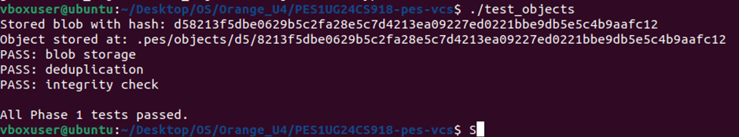

### Screenshot 1B — `find .pes/objects -type f` (sharded directory structure)

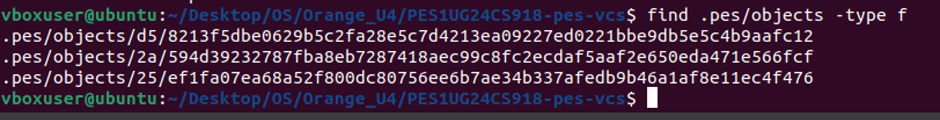

---

## Phase 2: Tree Objects

### Screenshot 2A — `./test_tree` output (all tests passing)

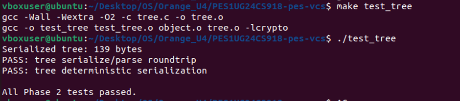

### Screenshot 2B — `xxd` of a raw object (first 20 lines, showing binary format)

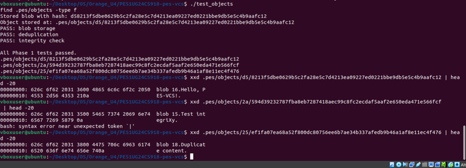

---

## Phase 3: The Index (Staging Area)

### Screenshot 3A — `pes init` → `pes add` → `pes status` sequence

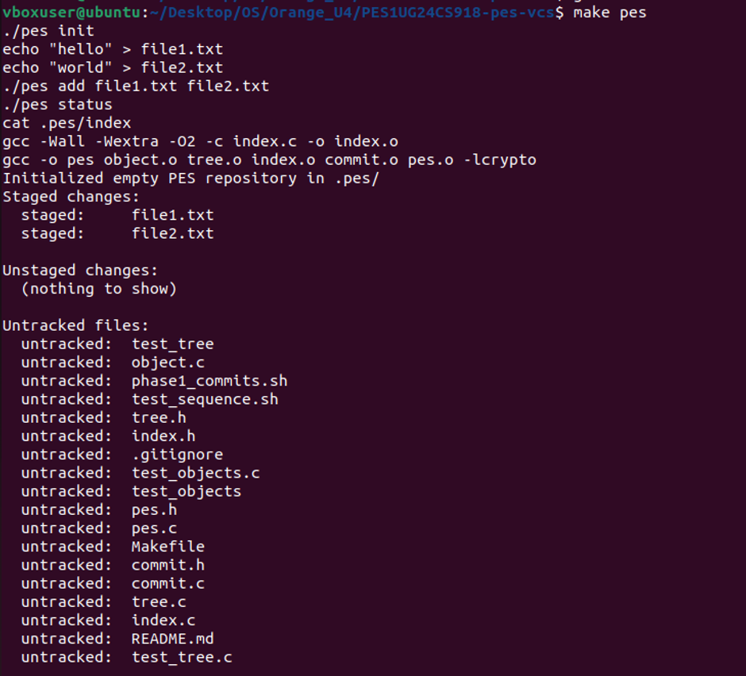

### Screenshot 3B — `cat .pes/index` (text-format index file)


---

## Phase 4: Commits and History

### Screenshot 4A — `pes log` output (three commits)

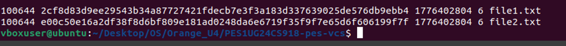

### Screenshot 4B — `find .pes -type f | sort` (object store growth)

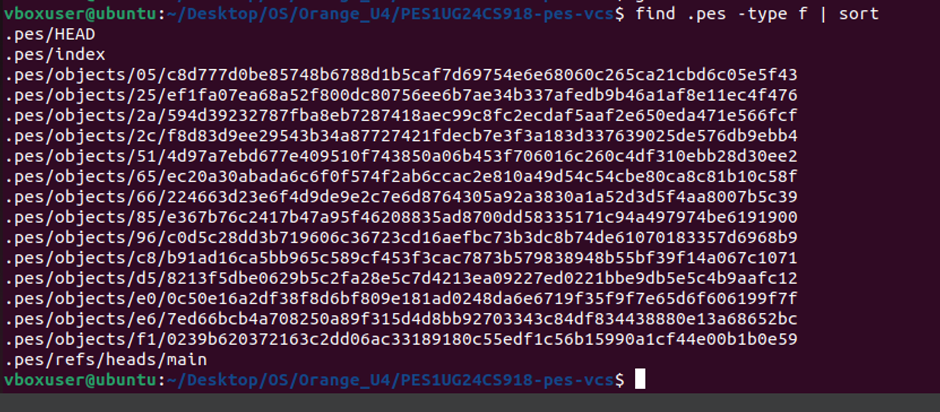

### Screenshot 4C — `cat .pes/refs/heads/main` and `cat .pes/HEAD`

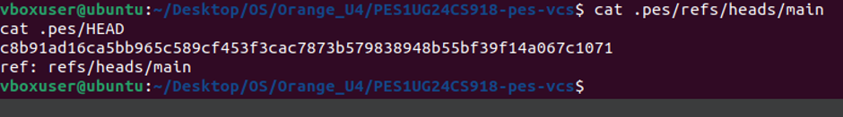

### Final — `make test-integration` (full integration test)

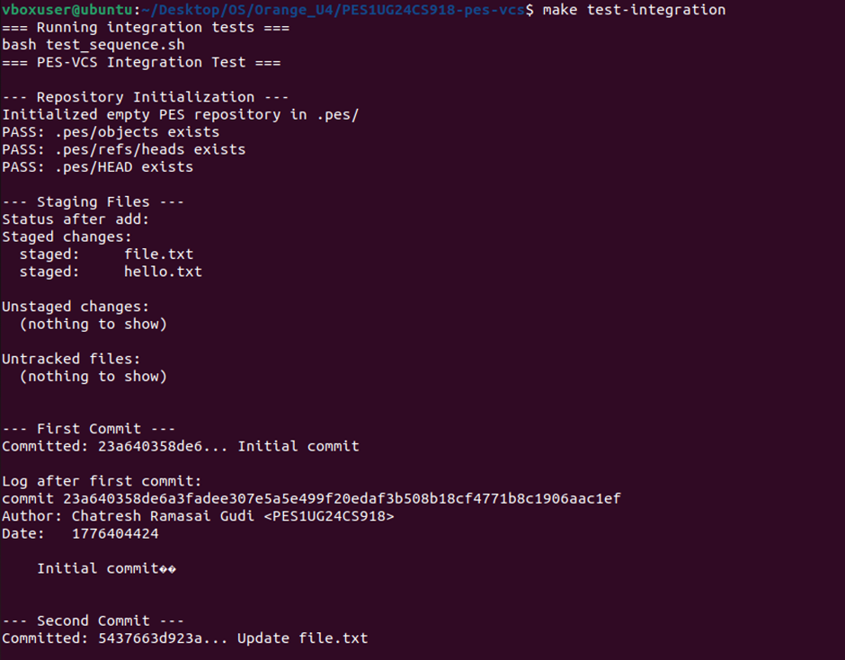
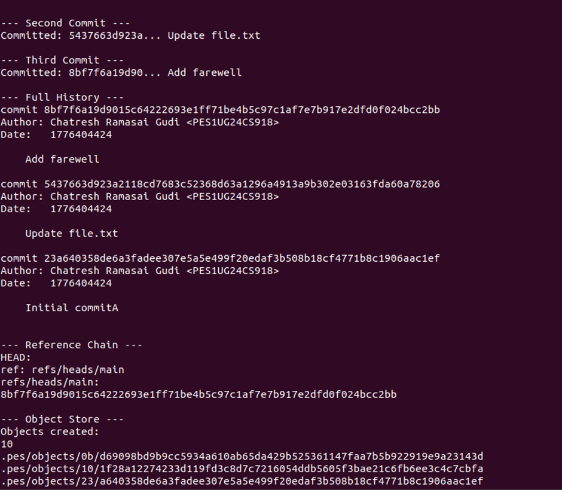
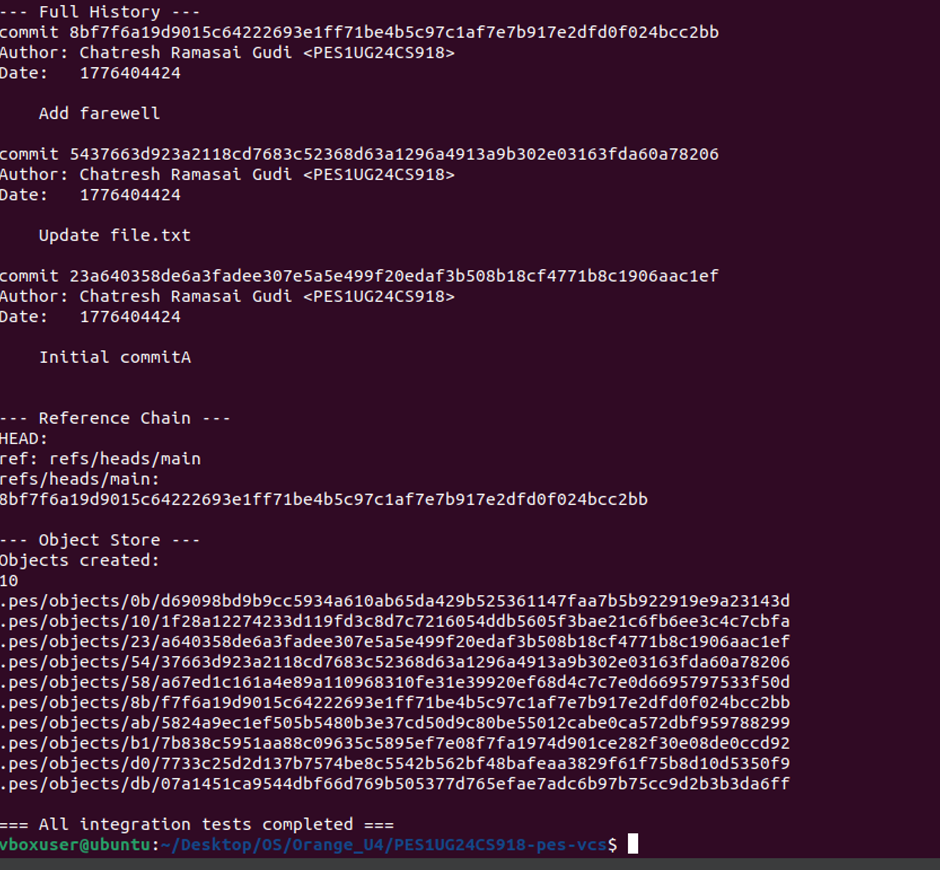

---

## Phase 5: Branching and Checkout (Analysis)

### Q5.1 — How would you implement `pes checkout <branch>`?

A branch in PES-VCS (like Git) is simply a file in `.pes/refs/heads/` containing a commit hash. Implementing `pes checkout <branch>` requires the following steps:

**Files that must change in `.pes/`:**
1. `.pes/HEAD` must be updated to `ref: refs/heads/<branch>` (pointing to the new branch).
2. If the branch doesn't exist yet (creating a new branch), a new file `.pes/refs/heads/<branch>` must be created with the current commit hash.

**Working directory changes:**
1. Read the target branch's commit hash from `.pes/refs/heads/<branch>`.
2. Read the commit object to get its tree hash.
3. Walk the tree recursively and restore every file in the tree to its stored blob content.
4. Files present in the working directory but not in the target tree must be deleted (unless they are untracked).

**What makes this complex:**
- **Three-way merge of working states:** Files can exist in (a) the current HEAD tree, (b) the target branch's tree, and (c) the working directory. Safe checkout must compare all three states.
- **Untracked files:** Files not in either tree must never be deleted — they belong to the user, not the VCS.
- **Dirty working directory:** If a file has unstaged changes and differs between the two branches, checkout must refuse (see Q5.2).
- **Atomicity:** Either all files switch to the new branch state or none do — a crash halfway would leave the repo in a corrupt mixed state.

---

### Q5.2 — How to detect a dirty working directory conflict during checkout?

To detect whether switching branches is safe without re-hashing every file, we can use the index as a fast intermediary:

1. **Load the current index** (staged state).
2. **For each file tracked in the index**, compare its stored `mtime` and `size` metadata against the actual file on disk using `stat()`.
   - If either differs → the file has been **modified but not staged** → "dirty".
3. **For the dirty files found**, check whether the target branch's tree contains a *different* blob hash for the same path.
   - Fetch the target tree from the object store, find the entry matching the file's path.
   - Compare its blob hash against the index entry's hash.
   - If they differ → **conflict**: the file is locally modified AND the branch would overwrite it → refuse checkout with an error.
4. If no conflicts are found, proceed with checkout.

This approach avoids re-reading and hashing file contents entirely — it uses the metadata fast-path (mtime + size) then only looks up object hashes for the subset of files that appear dirty.

---

### Q5.3 — What is "Detached HEAD" and how to recover lost commits?

**Detached HEAD** means `.pes/HEAD` contains a raw commit hash directly (e.g. `a1b2c3d4...`) instead of a branch reference (e.g. `ref: refs/heads/main`). This happens when you checkout a specific commit rather than a branch name.

**What happens if you commit in this state:**
- `commit_create` calls `head_update`, which sees HEAD contains a raw hash (not `ref: ...`) and writes the new commit hash directly into HEAD.
- The new commit is correctly created and stored in the object store.
- However, **no branch pointer moves** — the new commit is only reachable from HEAD itself.
- The moment you switch to any branch, HEAD gets overwritten and the new commit becomes **unreachable** — no branch, no ref points to it.

**How to recover:**
1. Find the "lost" commit hash — it was printed by `pes commit` when it was created. If that output was saved (e.g. in terminal history), use it directly.
2. Alternatively, scan all objects in `.pes/objects/` looking for commit-type objects. Compare timestamps or messages to identify the lost ones.
3. Once the hash is found, create a new branch pointing to it:
   ```bash
   echo "<lost-commit-hash>" > .pes/refs/heads/recovery
   ```
4. Switch to that branch via `pes checkout recovery` to re-attach the commits to a named branch.

In real Git, `git reflog` maintains a log of every HEAD position change, making recovery trivial.

---

## Phase 6: Garbage Collection (Analysis)

### Q6.1 — Algorithm to find and delete unreachable objects

**Algorithm (Mark and Sweep):**

**Mark phase — find all reachable hashes:**
1. Start from all branch refs in `.pes/refs/heads/` (the "roots").
2. For each branch, read the commit hash. Add it to a **reachable set** (a hash set / unordered_set for O(1) lookup).
3. Read the commit object:
   - Add its **tree hash** to the reachable set.
   - Recursively walk the tree: for each entry, add blob hashes; for subtrees, recurse and add those tree hashes too.
   - If the commit has a **parent**, add the parent hash and repeat from step 3 for the parent.
4. Continue until all commits in the history chain have been visited.

**Sweep phase — delete unreachable objects:**
1. Walk every file in `.pes/objects/XX/YYYYYYY...` using `find` or `opendir/readdir`.
2. Reconstruct the full hash from the directory name + filename.
3. If the hash is **not in the reachable set** → delete the file.

**Data structure:** An **unordered hash set** (e.g. C `uthash`, Python `set`, or a bitset over hash prefixes) gives O(1) average-case membership checks.

**Estimation for 100,000 commits, 50 branches:**
- Average files per commit: ~10 blobs + 3 trees + 1 commit = ~14 objects per commit.
- Unique objects (with heavy deduplication): ~100,000 × 14 × 0.3 (dedup factor) ≈ **420,000 objects to visit**.
- Reachable set size: ~420,000 hash entries × 32 bytes = ~13 MB in memory — easily manageable.

---

### Q6.2 — Race condition between GC and concurrent commit

**The race condition:**

Consider this interleaving:

| Time | GC process | Commit process |
|------|-----------|----------------|
| T1   | Scans object store, builds reachable set | — |
| T2   | — | Writes new blob object to `.pes/objects/` |
| T3   | — | Writes new tree object to `.pes/objects/` |
| T4   | GC sweep begins | — |
| T5   | GC sees blob — **not yet in any commit** → marks unreachable | — |
| T6   | GC **deletes the blob** | — |
| T7   | — | Writes commit object referencing the now-deleted tree/blob |
| T8   | — | Updates HEAD → commit points to missing object! |

The repository is now **corrupt**: the commit object references a blob that no longer exists.

**How Git avoids this:**

1. **Grace period / "recent objects" exemption:** Git's GC (`git gc`) never deletes objects created within the last 2 weeks (configurable via `gc.pruneExpire`). Since a commit in progress takes milliseconds, any objects written during a concurrent commit are "too recent" to delete.

2. **Lock files:** Git uses `.git/index.lock` and ref locks during write operations. GC can check for active lock files and refuse to run, or pause the sweep.

3. **Two-phase GC with a safety window:** Git first writes a list of "to be pruned" objects, waits for a configurable delay (e.g. 12 hours for `--prune=now` vs default 2 weeks), then deletes. Any objects referenced by a new commit within that window are spared.

The fundamental principle: **GC must only delete objects that have been unreachable for longer than the maximum possible duration of a concurrent write operation.**

---

*Report generated for PES-VCS Lab — Operating Systems, PESU*
